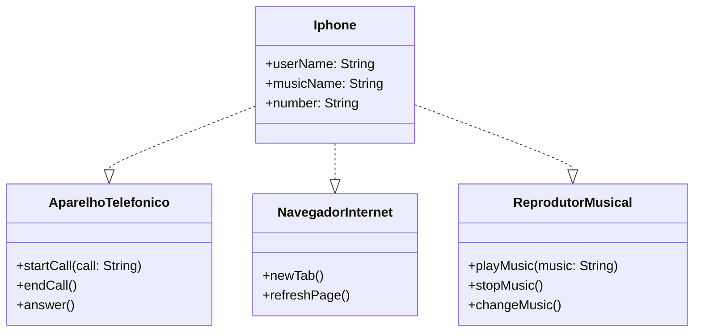

## Diagrama UML do Projeto

diagrama UML das classes e interfaces (abstraçao) implementadas para o desafio do iPhone

## Desafio:
https://github.com/digitalinnovationone/trilha-java-basico/tree/main/desafios/poo#exemplo-de-diagrama-uml-mermaid
